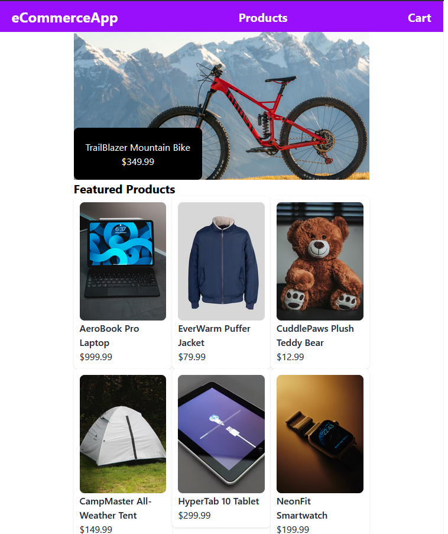
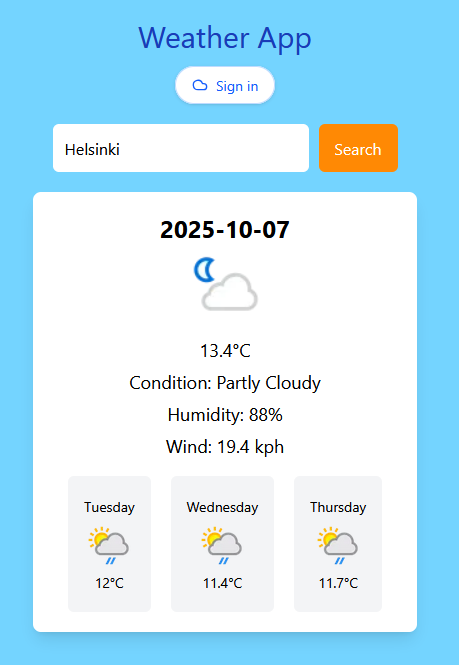
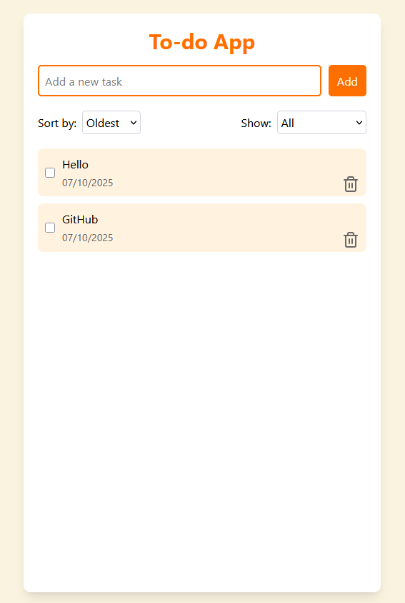

# 👋 Hi, I'm Alex Degerman

**Junior Full-Stack Developer | React • Node.js • MySQL**

Self-taught React and Node.js developer after learning Angular/Spring Boot in school. When I couldn't secure an internship, I researched what the market needed and pivoted to a modern stack. Built MovieCritic as my thesis project, a full-stack movie platform over four months. Now seeking my first professional role in Helsinki.

- 🔭 Currently: Seeking junior full-stack opportunities in Helsinki (remote-friendly)
- 🌱 Learning: Building production-ready web applications with modern JavaScript
- 💼 Available: Eligible for palkkatuki + Helsinki-lisä (wage subsidy)
- 📫 Reach me at [alex.degerman.dev@gmail.com](mailto:alex.degerman.dev@gmail.com) · [LinkedIn](https://www.linkedin.com/in/alex-degerman-402907245/?locale=en_US)
- 📍 Based in Helsinki, Finland

---

## 🔥 Tech Stack

**Frontend:**  
      

**Backend & APIs:**  
   

**Database & Auth:**  
   

**Deployment & Tools:**  
       

**Testing:**  
  

---

## 🎯 Featured Projects

### 🎬 Full-Stack App — *MovieCritic*

**Thesis project: A movie discovery and review platform with infinite scroll and user authentication.**  
Browse 12,000+ movies powered by the TMDb API and share reviews with the community. Four months of development from planning documentation to production deployment.

  
[Full 1080p 60fps demo](https://youtu.be/67wY0n5HYX0)

**Key Features:**
- Infinite-scroll movie browsing with search and genre filters
- Community-driven movie reviews and ratings
- Smooth, reactive UI with React + Zustand
- Secure access with JWT authentication and Google reCAPTCHA v3
- Auto-login demo mode for instant exploration

**Tech Stack:**  
React • Zustand • Vite • Node.js • Express • MySQL (Sequelize) • Aiven • JWT • reCAPTCHA v3 • Docker • Render

**Links:**  
🌐 [Live Demo](https://moviecriticfi.onrender.com) (auto-login enabled) • 📂 [Repository](https://github.com/AlexDegerman/MovieCritic)

---

### 🛒 E-commerce Website
An e-commerce SPA for browsing and filtering products, viewing individual product pages, and managing a cart summary.

**Features:**
- Rotating featured product carousel on the homepage
- Recommended product list and products grid with category filters
- Individual product pages with "add to cart" and cart total calculator

**Tech Stack:**  
React • TypeScript • Zustand • Tailwind • Next.js • Jest

**Links:**  
🌐 [Live Demo](https://e-commerce-app-next-red.vercel.app) • 📂 [Repository](https://github.com/AlexDegerman/e-commerce-app-next)

---

### 🌤️ Weather App
Check the weather for any city with a clean interface and 2-day forecast.

**Features:**
- Search any city's weather
- Google OAuth2 login (displays Google username)

**Tech Stack:** 
React • TypeScript • Tailwind • Redux • Next.js • WeatherAPI • Jest • OAuth 2.0

**Links:**  
🌐 [Live Demo](https://weather-app-next-rosy.vercel.app) • 📂 [Repository](https://github.com/AlexDegerman/weather-app-next)

---

### 📝 Todo App
A simple task management SPA to create, track, and organize todos.

**Features:**
- Create, mark complete, search, sort, and delete todos
- Smooth and responsive UI

**Tech Stack:**  
React • TypeScript • Redux • Tailwind • Vite • Vitest

**Links:**  
🌐 [Live Demo](https://alexdegerman.github.io/to-do-app-ts) • 📂 [Repository](https://github.com/AlexDegerman/to-do-app-ts)