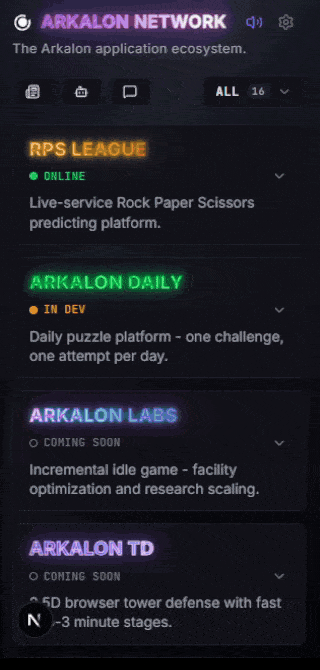

### 👋 Hi, I'm Alex Degerman

**Junior Full-Stack Developer. React, Next.js, TypeScript, Node.js, PostgreSQL**

Helsinki-based full-stack developer. I build production applications for the Arkalon universe end to end, from architecture and implementation to deployment, monitoring, and ongoing operation.

🚀 **Live now:** [RPS League](https://rpsleague.fi), a real-time platform processing 17,000+ matches daily, in continuous production since launch.

🔧 **Currently building:** new applications and interactive experiences as part of the wider **[Arkalon universe](https://github.com/AlexDegerman?tab=repositories)**. RPS League's core experience is now complete and remains live in production, with future fixes, improvements, events, and features planned for later releases.

💼 Eligible for Helsinki-lisä + Youth Recruitment Subsidy (up to €1,500/month, 18 months) for Finnish employers.

📫 [alex.degerman.dev@gmail.com](mailto:alex.degerman.dev@gmail.com) · [LinkedIn](https://www.linkedin.com/in/alex-degerman) · Helsinki, Finland

---

## Featured Projects

### 🎲 [RPS League](https://github.com/AlexDegerman/rps-league-app): real-time live-service platform

Sole developer and maintainer of a production Rock Paper Scissors prediction platform. Players predict high-frequency matches using virtual points; I built the core experience end to end and run the system continuously in production, monitoring it, fixing issues, and continuing to develop future content and improvements.

- Real-time SSE event pipeline, 5-second match cycle, 17,000+ automated matches daily
- Native BigInt economy for precise values at vigintillion scale
- Gemini-powered AI Oracle with context grounding, caching, and multi-model fallback
- Production reliability: Sentry monitoring, structured logging, in-app feedback system

**Stack:** React (Next.js), TypeScript, Node.js (Express), PostgreSQL (Supabase), SSE, Gemini AI, Vitest

🌐 [rpsleague.fi](https://rpsleague.fi) · 📂 [Repo](https://github.com/AlexDegerman/rps-league-app)

---

### 🌐 [Arkalon Network](https://github.com/AlexDegerman/arkalon-network): central ecosystem hub & identity platform

Architect and sole developer of the foundational identity and telemetry platform connecting the wider Arkalon universe. Acts as the anchor for all current and upcoming applications, synchronizing user identities, global telemetry, and session state across the ecosystem.

- **Zero-Friction SSO**: Local-first account system with instant on-arrival provisioning, deterministic 3-word nicknames, and dual-cookie root domain authentication (`.rpsleague.fi`).
- **AI Arkalon (RAG Engine)**: In-universe analytical oracle featuring sub-2ms hybrid semantic/keyword retrieval, multi-model fallback pipelines, and strict conversational lifecycle constraints.
- **Ecosystem Directory & Telemetry**: Modular genre filtering, silent hype telemetry for roadmap prioritization, and dynamic application lifecycle status tracking across 16+ experiences.
- **Production Security**: HMAC-SHA256 signed session tokens, constant-time verification, layered rate limiting, and ephemeral IP handling with zero PII storage.

**Stack:** Next.js 16, React 19, TypeScript, Tailwind CSS v4, Zustand, PostgreSQL, Zod, Docker

🌐 [network.rpsleague.fi](https://network.rpsleague.fi/) · 📂 [Repo](https://github.com/AlexDegerman/arkalon-network)

---

### 🎬 [MovieCritic](https://github.com/AlexDegerman/MovieCritic): full-stack movie platform

Capstone project: a movie discovery platform with 12,000+ titles, authentication, and multilingual support, built and deployed end to end in 3 months.

- JWT authentication, bcrypt hashing, Google reCAPTCHA v3
- Infinite scroll with preemptive loading, no pagination buttons
- Production database migrations across three cloud providers

**Stack:** React, Node.js (Express), MySQL (Sequelize), Docker

🌐 [Live demo](https://moviecriticfi.onrender.com) (auto-login enabled) · 📂 [Repo](https://github.com/AlexDegerman/MovieCritic)

---

## Other Projects

- **[E-commerce SPA](https://github.com/AlexDegerman/e-commerce-app-next)**: product catalog, filtering, cart. React, TypeScript, Zustand. [Demo](https://e-commerce-app-next-red.vercel.app)
- **[Weather App](https://github.com/AlexDegerman/weather-app-next)**: OAuth2 and forecast API. React, TypeScript, Redux Toolkit. [Demo](https://weather-app-next-rosy.vercel.app)
- **[Todo App](https://github.com/AlexDegerman/to-do-app-ts)**: task manager with filtering and sorting. React, TypeScript, Redux Toolkit. [Demo](https://alexdegerman.github.io/to-do-app-ts)

---

## Tech Stack

**Frontend:** React, Next.js, TypeScript, Zustand, Redux Toolkit, Tailwind CSS

**Backend:** Node.js, Express, REST APIs, PostgreSQL, MySQL, Sequelize

**DevOps:** Git, GitHub Actions, Docker, Vercel, Render, Sentry

**Testing:** Vitest, Jest, React Testing Library

**Also:** Angular, Spring Boot, Java (vocational training and Scrum team projects)