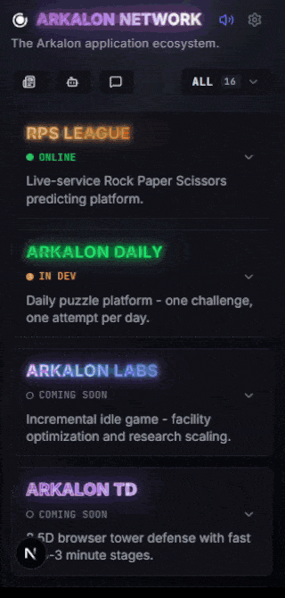
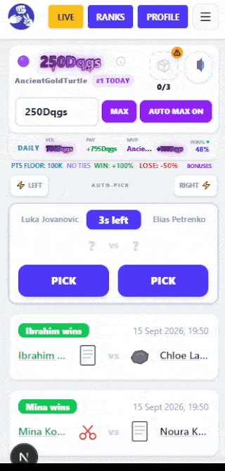
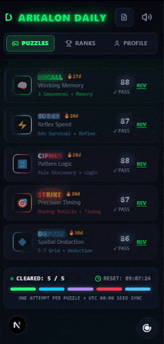

### Hi, I'm Alex Degerman

**Junior Full-Stack Developer. React, Next.js, TypeScript, Node.js, PostgreSQL**
Helsinki-based full-stack developer. I build and operate the **Arkalon ecosystem**, a multi-app platform connected through a custom identity API, with multiple live production services running on self-managed infrastructure.

**Live now:** [Arkalon Network](https://network.rpsleague.fi) (identity hub and API), [RPS League](https://rpsleague.fi) (real-time prediction platform, 17,000+ matches daily), and [Arkalon Daily](https://daily.rpsleague.fi) (daily puzzle platform, five categories).

**Currently building:** Arkalon Labs, the next application in the ecosystem. RPS League and Arkalon Daily remain live in production, with future fixes, improvements, events, and features planned for later releases.

Eligible for Helsinki-lisä + Youth Recruitment Subsidy (up to 1,500 EUR/month, 18 months) for Finnish employers.

[alex.degerman.dev@gmail.com](mailto:alex.degerman.dev@gmail.com) | [LinkedIn](https://www.linkedin.com/in/alex-degerman) | Helsinki, Finland

---

## Featured Projects

### [Arkalon Network](https://github.com/AlexDegerman/arkalon-network): central ecosystem hub and identity platform

Sole architect and developer of the foundational identity and API platform connecting the wider Arkalon universe. Acts as the anchor for all current and upcoming applications, synchronizing user identities, shared services, and session state across the ecosystem.

- **Zero-Friction SSO**: Local-first account system with instant on-arrival provisioning, deterministic 3-word nicknames, and dual-cookie root domain authentication (`.rpsleague.fi`).
- **Internal Identity APIs**: Secret-protected REST endpoints for identity provisioning and nickname rerolling consumed by all satellite applications, keeping the Network as the single source of truth.
- **AI Arkalon (RAG Engine)**: In-universe analytical oracle featuring sub-2ms hybrid semantic/keyword retrieval, multi-model Gemini fallback pipeline, and strict conversational lifecycle constraints.
- **Feedback and Moderation**: Centralized feedback system routing reports to Discord webhooks with app-aware categorization across 16+ applications, screenshot uploads, and admin moderation tools.
- **Production Security**: HMAC-SHA256 signed session tokens, constant-time verification, layered rate limiting, and ephemeral IP handling with zero PII storage.

**Stack:** Next.js 16, React 19, TypeScript, Tailwind CSS v4, Zustand, PostgreSQL, Zod, Docker

[network.rpsleague.fi](https://network.rpsleague.fi/) | [Repo](https://github.com/AlexDegerman/arkalon-network)

---

### [RPS League](https://github.com/AlexDegerman/rps-league-app): real-time live-service platform

Sole developer and maintainer of a production Rock Paper Scissors prediction platform, the first and most mature application in the Arkalon ecosystem. Players predict high-frequency matches using virtual points; I built the core experience end to end and run the system continuously in production, monitoring it, fixing issues, and continuing to develop future content and improvements.

- Real-time SSE event pipeline, 5-second match cycle, 17,000+ automated matches daily, 3,000,000+ total matches processed
- Native BigInt economy for precise values at vigintillion scale
- Complex real-time state orchestration across matches, events, and persistent sessions with server-authoritative processing
- Production reliability: Sentry monitoring, structured logging, automated database cleanup

**Stack:** React (Next.js), TypeScript, Node.js (Express), PostgreSQL (Supabase), SSE, Vitest

[rpsleague.fi](https://rpsleague.fi) | [Repo](https://github.com/AlexDegerman/rps-league-app)

---

### [Arkalon Daily](https://github.com/AlexDegerman/arkalon-daily): daily puzzle platform

Sole developer and maintainer of a browser-based daily puzzle platform with five cognitive categories targeting distinct skills: working memory, rapid reflex, pattern reasoning, timing accuracy, and spatial deduction. Every player who opens a category on the same day receives the identical seeded challenge. One attempt per category per day.

- HMAC-SHA256 seeded deterministic puzzle engine generating identical challenges for all players, with per-family validation and automatic retry logic
- Server-authoritative scoring across five categories with streak recomputation, multi-tier leaderboards, and rarity-based progression
- PWA with Web Audio polyphony engine, browser-native TTS voice system, and client-side share card generation
- Ultra-compact viewport resilience (320px) with adaptive wide-screen layout scaling to 1152px+

**Stack:** Next.js 16, React 19, TypeScript, Tailwind CSS v4, Zustand, PostgreSQL, Zod, Docker

[daily.rpsleague.fi](https://daily.rpsleague.fi) | [Repo](https://github.com/AlexDegerman/arkalon-daily)

---

### [MovieCritic](https://github.com/AlexDegerman/MovieCritic): full-stack movie platform (capstone)

Capstone project: a movie discovery platform with 12,000+ titles, authentication, and multilingual support, built and deployed end to end in 3 months.

- JWT authentication, bcrypt hashing, Google reCAPTCHA v3
- Infinite scroll with preemptive loading, no pagination buttons
- Production database migrations across three cloud providers

**Stack:** React, Node.js (Express), MySQL (Sequelize), Docker

[Live demo](https://moviecriticfi.onrender.com) (auto-login enabled) | [Repo](https://github.com/AlexDegerman/MovieCritic)

---

## Other Projects

- **[E-commerce SPA](https://github.com/AlexDegerman/e-commerce-app-next)**: product catalog, filtering, cart. React, TypeScript, Zustand. [Demo](https://e-commerce-app-next-red.vercel.app)
- **[Weather App](https://github.com/AlexDegerman/weather-app-next)**: OAuth2 and forecast API. React, TypeScript, Redux Toolkit. [Demo](https://weather-app-next-rosy.vercel.app)
- **[Todo App](https://github.com/AlexDegerman/to-do-app-ts)**: task manager with filtering and sorting. React, TypeScript, Redux Toolkit. [Demo](https://alexdegerman.github.io/to-do-app-ts)

---

## Shared Infrastructure

All ecosystem applications run on a single Hetzner Cloud VPS with Docker Compose, Caddy reverse proxy with automatic TLS, PostgreSQL 17, automated daily backups to Backblaze B2, and GitHub Actions CI/CD via SSH.

---

## Tech Stack

**Frontend:** React, Next.js, TypeScript, Zustand, Redux Toolkit, Tailwind CSS

**Backend:** Node.js, Express, REST APIs, PostgreSQL, MySQL, Sequelize, SSO, Cross-App Auth

**AI:** Gemini API, RAG retrieval, multi-model fallback, context grounding

**DevOps:** Git, GitHub Actions, Docker, Caddy, Hetzner VPS, Sentry

**Testing:** Vitest, Jest, React Testing Library

**Also:** Angular, Spring Boot, Java (vocational training and Scrum team projects)
